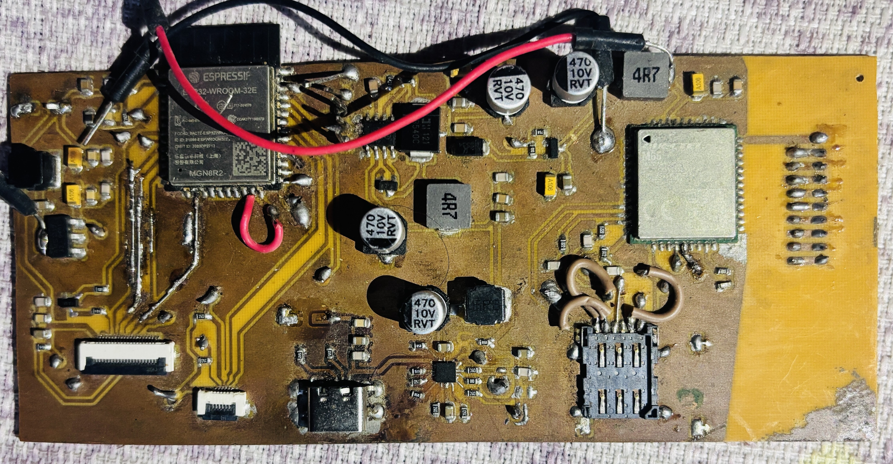
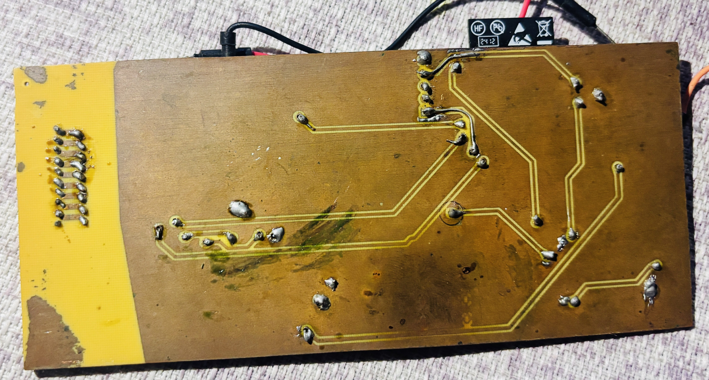
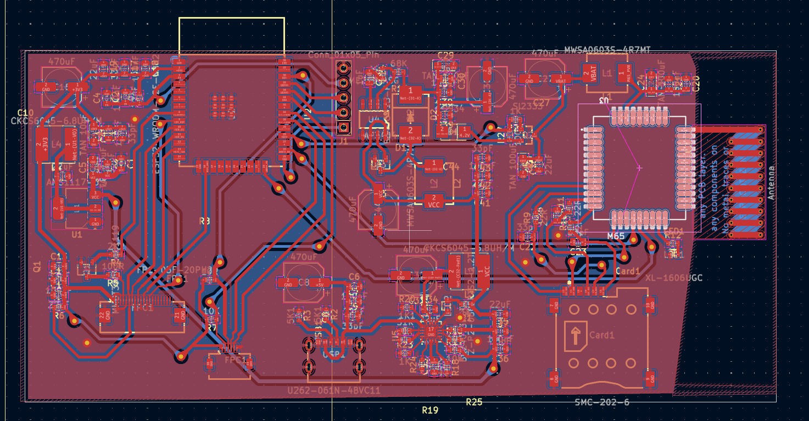

# Custom ESP32 Mobile System PCB

I always dreamed of building my own mobile system. This repo documents my custom ESP32 PCB design featuring a GSM module, display interface, and a complete Battery Management System (BMS).

All subsystems were designed in KiCad and independently validated. Schematics, layout, and testing are complete—I'm just sourcing a suitable display for final integration.

---

## 📷 PCB Images

| Front | Back | KiCad 3D View |
| :---: | :---: | :---: |
|  |  |  |

---

## ✨ What's on the Board

| Component | Description |
| :--- | :--- |
| **ESP32-WROOM** | Main microcontroller (WiFi + BLE) |
| **GSM Module** | Quectel M65 module |
| **Charging Circuit** | BQ Chip |
| **Display Interface** | SPI for display and I2C for charhing |

---

## 📂 Files

- `Mobile_System.kicad_sch` – Schematic
- `Mobile_System.kicad_pcb` – PCB layout
- `gerbers/` – Manufacturing files
- `BOM.csv` – Bill of Materials

---

## 📌 Status

- ✅ Schematic – Complete
- ✅ PCB Layout – Complete
- ✅ BMS Validation – Passed
- ✅ GSM Validation – Passed
- ⏳ Display Integration – In progress (sourcing)
- ⏳ Firmware – Next step

---

## 🛠️ Tools

- **KiCad** – PCB design
- **Arduino / PlatformIO** – Firmware (coming soon)

---

## 👤 Author

**Sumit Sigdel**  
GitHub: [sumit123hub](https://github.com/sumit123hub)

---

